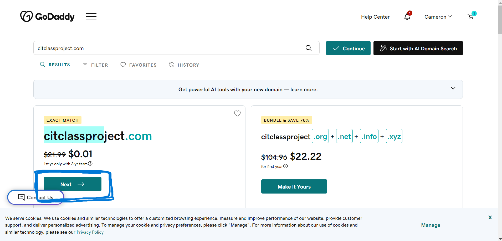
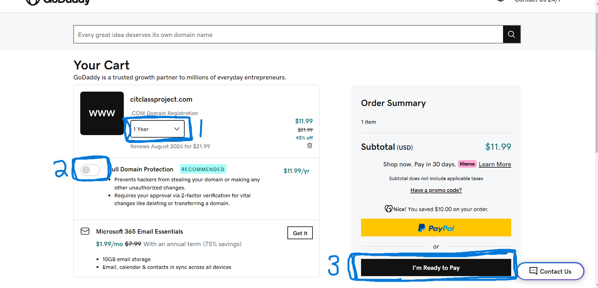
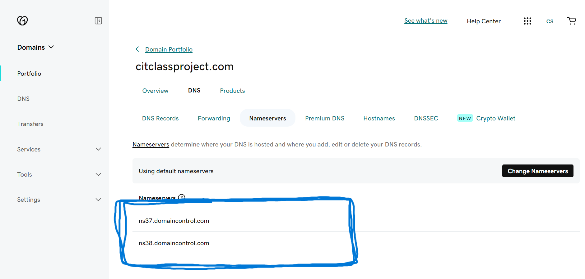
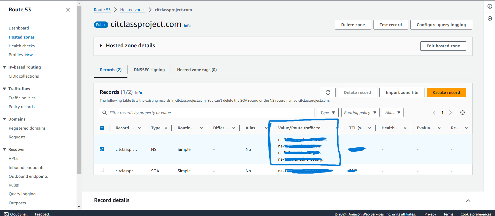
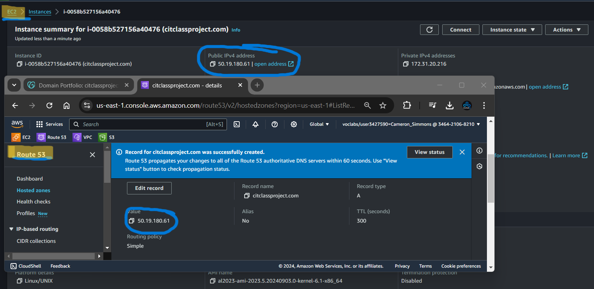

<<<<<<< HEAD:03-AmazonWebServices270/01-DNS.md
# Computer Information Technology 270

> This is what I could remember on the first day for the first day

1. Create a domain
1. Link domain to AWS class account
1. Create a  instance in EC2 
1. SSH into your EC2 with public DNS (IPv4)
1. Create a record to link the do


## Get a domain
1. Create an account with "godaddy.com".
1. Enter the name of domain you want for class.

<br>


3. From here you will go to your cart.
    > Here are the things I did.

    1. The time for the domain.
    1. Turn off full domain protection.
    1. Now pay.

<br>


## Link domain to AWS class account
- Now that I have paid for the domain, I want to go to try and link my domain to AWS account.
1. At the Home page click on **domain**.
1. Next click **DNS**.
1. Finally click on **nameservers**.
> The page should look like this. Keep this page open and we will come back to it.

<br>


4. Now login to your AWS Canvas account.
    > If you have any problems logging please talk with the professor.
5. Open the **Learners Lab - AM #85291** in the dashboard.
6. Scroll down to **Launch AWS Academy Learner Lab**.
7. Start the Lab. 
    > (When the lab is ready click on the **AWS** with the button is green on the left of the page)
8. Once inside go to the search bar and look up **"Route 53"**.
9. Click on **Hosted zones**.
10. In Domain name input the domain name you paid.
11. In Type click **Public hosted zone**.
12. Click **Create hosted zone**.
13. Once created this is the page I got.

<br>

<br>

14. Take the values and bring them to the **godaddy.com** page we stopped at with the nameservers.
15. Click **Change Nameservers** , **I'll use my own nameservers** copy all four of them over to **godaddy.com**.
16. Once that is done save the changes. (I think that was everything we did in class for this)

## Create a  instance in EC2 
- Once we have add the nameservers close the godaddy webpage I dont recall going back to it. And head on back to the AWS Lab. Once in the lab look up EC2.
1. The Home page should have an **Launch instance**
2. Give the instance a name I used my domain name.
3. Scroll down to Key pair login.
4. Click the down arrow change it to **vockey** (next to Create New key pair)
5. Next in Network settings 
    Allow SSH traffic from **change to Anywhere**
    **CHECK THE BOX** Allow HTTPS traffic from the internet
    **CHECK THE BOX** Allow HTTP traffic from the internet
6. **Launch instance**
## Route 53
1. Now that are machine is up and running we want to make a record.
2. In **Route 53** create a record.
3. **DON'T GIVE THE RECORD A NAME**
4. Now take the public IPv4 in this example I have 50.19.180.61 from EC2 and paste it in the record 

<br>

> This is linking your domain to you IP. 

## Downloading the keypair
1. Go back to your AWS Canvas Learner's Lab click on **AWS details**


<br>

2. Click on **DOWNLOAD PEM**
3. This will download the keypair you will need to login to your instance.


## SSH into you machine to see if it up and running.
1. Locate and download your key for class as a pem file. The key is called **labsuser**.
2. Open powershell to the file with the key
> For this example I have moved my key to a directory to awscit270

```markdown 

Windows PowerShell
Copyright (C) Microsoft Corporation. All rights reserved.

Install the latest PowerShell for new features and improvements! https://aka.ms/PSWindows

PS C:\Users\Cameron> cd .\Downloads\
PS C:\Users\Cameron\Downloads> ls


    Directory: C:\Users\NightShrowd\Downloads


Mode                 LastWriteTime         Length Name
----                 -------------         ------ ----
-a----         8/30/2024  10:12 PM           1678 labsuser.pem

```


> Here we are in the file with the key

3. Now type the command:
```markdown
PS C:\Users\Cameron\Downloads> ssh ec2-user@citclassproject.com -i .\labsuser.pem
   ,     #_
   ~\_  ####_        Amazon Linux 2023
  ~~  \_#####\
  ~~     \###|
  ~~       \#/ ___   https://aws.amazon.com/linux/amazon-linux-2023
   ~~       V~' '->
    ~~~         /
      ~~._.   _/
         _/ _/
       _/m/'
[ec2-user@ip-172-31-29-159 ~]$
```
> If you get this message back from AWS in your powershell instance when you ssh in you are done. **"MOM LOVE YOU"**
=======
# Computer Information Technology 270

> This is what I could remember on the first day for the first day

1. Create a domain
1. Link domain to AWS class account
1. Create a  instance in EC2 
1. SSH into your EC2 with public DNS (IPv4)
1. Create a record to link the do


## Get a domain
1. Create an account with "godaddy.com".
1. Enter the name of domain you want for class.

<br>


3. From here you will go to your cart.
    > Here are the things I did.

    1. The time for the domain.
    1. Turn off full domain protection.
    1. Now pay.

<br>


## Link domain to AWS class account
- Now that I have paid for the domain, I want to go to try and link my domain to AWS account.
1. At the Home page click on **domain**.
1. Next click **DNS**.
1. Finally click on **nameservers**.
> The page should look like this. Keep this page open and we will come back to it.

<br>


4. Now login to your AWS Canvas account.
    > If you have any problems logging please talk with the professor.
5. Open the **Learners Lab - AM #85291** in the dashboard.
6. Scroll down to **Launch AWS Academy Learner Lab**.
7. Start the Lab. 
    > (When the lab is ready click on the **AWS** with the button is green on the left of the page)
8. Once inside go to the search bar and look up **"Route 53"**.
9. Click on **Hosted zones**.
10. In Domain name input the domain name you paid.
11. In Type click **Public hosted zone**.
12. Click **Create hosted zone**.
13. Once created this is the page I got.

<br>

<br>

14. Take the values and bring them to the **godaddy.com** page we stopped at with the nameservers.
15. Click **Change Nameservers** , **I'll use my own nameservers** copy all four of them over to **godaddy.com**.
16. Once that is done save the changes. (I think that was everything we did in class for this)

## Create a  instance in EC2 
- Once we have add the nameservers close the godaddy webpage I dont recall going back to it. And head on back to the AWS Lab. Once in the lab look up EC2.
1. The Home page should have an **Launch instance**
2. Give the instance a name I used my domain name.
3. Scroll down to Key pair login.
4. Click the down arrow change it to **vockey** (next to Create New key pair)
5. Next in Network settings 
    Allow SSH traffic from **change to Anywhere**
    **CHECK THE BOX** Allow HTTPS traffic from the internet
    **CHECK THE BOX** Allow HTTP traffic from the internet
6. **Launch instance**
## Route 53
1. Now that are machine is up and running we want to make a record.
2. In **Route 53** create a record.
3. **DON'T GIVE THE RECORD A NAME**
4. Now take the public IPv4 in this example I have 50.19.180.61 from EC2 and paste it in the record 

<br>

> This is linking your domain to you IP. 

## Downloading the keypair
1. Go back to your AWS Canvas Learner's Lab click on **AWS details**


<br>

2. Click on **DOWNLOAD PEM**
3. This will download the keypair you will need to login to your instance.


## SSH into you machine to see if it up and running.
1. Locate and download your key for class as a pem file. The key is called **labsuser**.
2. Open powershell to the file with the key
> For this example I have moved my key to a directory to awscit270

```markdown 

Windows PowerShell
Copyright (C) Microsoft Corporation. All rights reserved.

Install the latest PowerShell for new features and improvements! https://aka.ms/PSWindows

PS C:\Users\Cameron> cd .\Downloads\
PS C:\Users\Cameron\Downloads> ls


    Directory: C:\Users\NightShrowd\Downloads


Mode                 LastWriteTime         Length Name
----                 -------------         ------ ----
-a----         8/30/2024  10:12 PM           1678 labsuser.pem

```


> Here we are in the file with the key

3. Now type the command:
```markdown
PS C:\Users\Cameron\Downloads> ssh ec2-user@citclassproject.com -i .\labsuser.pem
   ,     #_
   ~\_  ####_        Amazon Linux 2023
  ~~  \_#####\
  ~~     \###|
  ~~       \#/ ___   https://aws.amazon.com/linux/amazon-linux-2023
   ~~       V~' '->
    ~~~         /
      ~~._.   _/
         _/ _/
       _/m/'
[ec2-user@ip-172-31-29-159 ~]$
```
> If you get this message back from AWS in your powershell instance when you ssh in you are done. **"MOM LOVE YOU"**
>>>>>>> 2025c9a6f8b652f18787039e064f49d47c2aff64:cit270/01-week1-DNS.md
