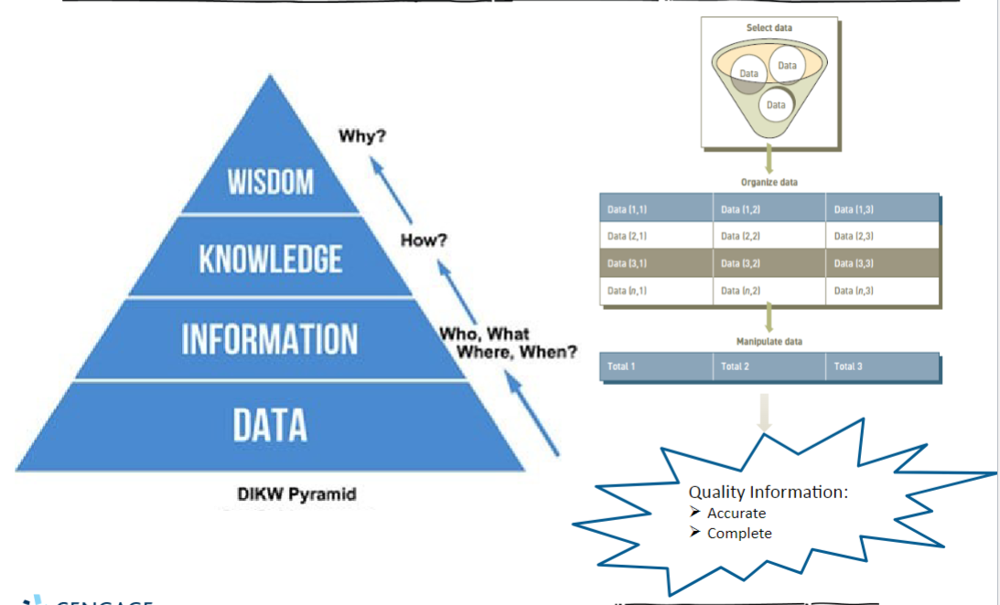

# An introduction to Information Systems 

## Learning Objectives:
#### After completing this chapter , we will be able to:
- distinguish data , information , and knowledge in the digital age.
- Identify fundamental components of Information Systems (IS).
- Identify types of fundamental IS in organizations.
- Describe the role of an organization's IT infrastructure.
- Discuss why it is critical for business objectives and IS activities to be aligned in organizations.
- Identify IS security threats as well as legal, social, and ethical issues associated with IS.
#### This is an overview chapter on topics covered in the semester.

## Data, Information , Knowledge , Wisdom
- Data - Basic , discrete , objective facts about something such as who, what, when, where ...
- Information - Collection of data organized and processed in such a way that they can add value; One of the most valuable organizational resources.
- Knowledge - Awareness and understanding of a systematic set of information and the ways it can be made useful.
- Wisdom - Knowledge to be applied to different situations. 
- Process or Procedure: A set of logically related tasks performed to achieve a defined outcome.
  > Turning data into information is a process / procedure.

#### Types of data 
|Data                     |Represented by
|-------------------------|----------------------------------------|
| Alphanumeric data       |Number , letters , and other characters 
| Audio data              |Sounds , noises , or tones
| Image data              |Graphic images and pictures
| Video data              |Moving images or pictures

#### Transforming Data into Information , Knowledge, and Wisdom:
  > Process & Procedure 

## What is an Information System (IS)?
An **information system** (IS) is a systematic set of interrelated elements that:
- Collect (input)
- Process
- Store
- Disseminate data and information.
- Provides a feedback mechanism to monitor and control its operations to make sure it continues to meet organizational goals and objectives.
  
A **Computer-based informations system** (CBIS) is a set of hardware , software, databases, network , people , and procedures.
- Configured to collect, manipulate , store , and process data information.
- A.K.A. computer information systems (CIS)

**An organization's technology infrastructure** includes all the hardware , software , databases, network , people , and procedures
- That are configured to collect , manipulate , store , and process data into information.

## what is an Information System ?
- A **process of procedure** defines the steps to follow to achieve a specific and results
  > Such as enter a customer order, pay a supplier invoice , or request a current inventory report.
- Using an IS involves setting and follwoing many procedures, including those for:
  > Analysis , design , implementation , maintenance , and security of the information system.

## Information systems in Organizations
### 3 types of IS
- **Personal IS**: IS that improve the productivity of regular users.
- **Group IS**: IS that improve communications and support collaboration among members of a workgroup.
- **Enterprise IS**: IS that organizations use to define structued interactions among employees and/or customers , suppliers government agencies, etc.

## Information Systems in Organizations
# place a picture

## Hardware Devices 
### Hardware:
- Consists of computer equipment used to perform input, processing , storage, and output activities.
- A **trend** in IT industry is to produce smaller, faster , and more mobile and powerful hardware.
- Innovative new hardware devices:
> Advanced keyboards
> Laptops and display that connect wirelessly
>Very-high resolution display devices

## Software Applications

### Software
- Consists of computer programs that govern the operation of a computing device.
### Two types of software
- System Software - Operating systems: Oversee basic computer operations such as start-up, controls access to system resources , and manage memory and files.
- Applications software : Allows to accomplish specific tasks, including editing text documents, creating graphs , and playing games. 
### Business application software
- Can be categorized by whether it is used by an individual, a small business , or a large multinational enterprise.

## Database System
### Database
- An Organized collection of data and information, typically consisting of two or more related data files.
- For example, a database contain data and information on customers, employees, inventory, sales , online purchases, etc.
### Data Warehouse 
- A database that stores large amounts of historical data in a form that readily supports analysis and management decision making.

## Network and Cloud computing 

### Network 
- Connect computers and other computing equipment in a room, building campus , city ,or globe to enable electronic communication.

### Internet 
- **Internet of Things (IOT)** - A network of pysical objects embedded with sensors , processors,software, and network connectivity capability to enable them to exchange data with the manufacturer of the device, device operators , and other connected devices.
> Encompasses not only machine-to0machine but also people-to-people and people-to-machine connections.

- World's largest computer network.
> Enable communication , collaboration , search functions , and information sharing between member of an organization using a web browser.

>A network based on web technologies that allows selected outsiders to access authorized resources of a company's intranet.

### Cloud computing 
- A service provider organization owns and manages hardware, software , networking , and storage devices in order to provide shared resources to users via the internet.

## Business Information Systems (BIS)
- IS are used in all functional areas of business organizations: Business IS
> Accounting and finance 
> Customer service 
> Human resources
> Manufacturing 
> Research & Development 
> Sales & Marketing 

## Electronic Commerce and Mobile Technology
- **E-Commerce** involves the exchange of money for goods and services over electronic network. 

- Mobile commerce (m-commerce) The use of mobile , wireless devices to place orders and conduct business. 
- Used to support all forms of e-commerce 
1. Business-to-Business(B2B)
1. Business-to-Consumer(B2C)
1. Consumer-to-Consumer(C2C)
1. Governement-to-Consumer(G2C)

- **E-business:** use of information systems and the internet to perform business-related tasks and functions

## Organizational Information Systems 
- Management information system (MIS):
1. Organized collection of people , procedures , software databases, and devices.
1. Provides information to managers and decision makers.
1. Focuses  on operational efficiency
1. Provides standards reports generated with data and information form the transaction processing system (TPS) or enterprise resource planning (ERP)

## Enterprise systems 
- Enterprise resource planning (ERP):
1. A set of integrated enterprise software programs.
1. Manages business operations for an entire organization.
- Most ERP systems provide integrated software to support manufacturing and finance:
1. Also provide support for business analytics and e-business.

## Is Acquisition and development 
- Information systems acquisition
1. Process to obtian the IS resources needed to provide the organization with computing services to meet organizational needs.

- IS development
1. The activites of building IS to meet organizational needs
1. IS Development project can range from small to very large.

## IS Security in Businesses and Society
- The widespread use of IS 
> Opens users to a variety of threats from unethical people.
- Computer-realted attacks can come from individuals , groups , companies and countries.

## Ethical, Legal , and Social Issues of IS Use
- The use of information about people
1. Requires balancing the needs of those who want to use the information against the rights and desires of people whose information may be used. 

- **Internet Censorship**
1. The control or suppression of publishing or accessing of information on the internet.
- **Digital Divide** 
1. A term used to describe the gulf between those who do and those who don't have access to modern IS.
- **Net Neutrality**
1. The principle that internet service providers (ISPs) should be required to treat all internet traffic the same.
- **"Big Fat Fake News "**
1. The widespread of vast volme of false or misleading information over the internet.

## SUMMARY
1. The value of information is directly linked to how it helps decision makers achieve the organization's goals in the digital age.

1. IS are composed of fundamental components that must be carefully assembled and integrated to work well together.

1. Managers have an essential role to play in the successfull implementation and use of IS-that roles change depending on which type of IS is being implemented.

1. An organization's infrastructure technology forms the foundation upon which information systems and applications are built. 

1. Organizations employ a variety of IS to improve the way they conduct business and make fact-based decisions.

1. IS must be applied thoughtfully and carefully so that society, organizations , and individuals can reap the enormous benefits.
