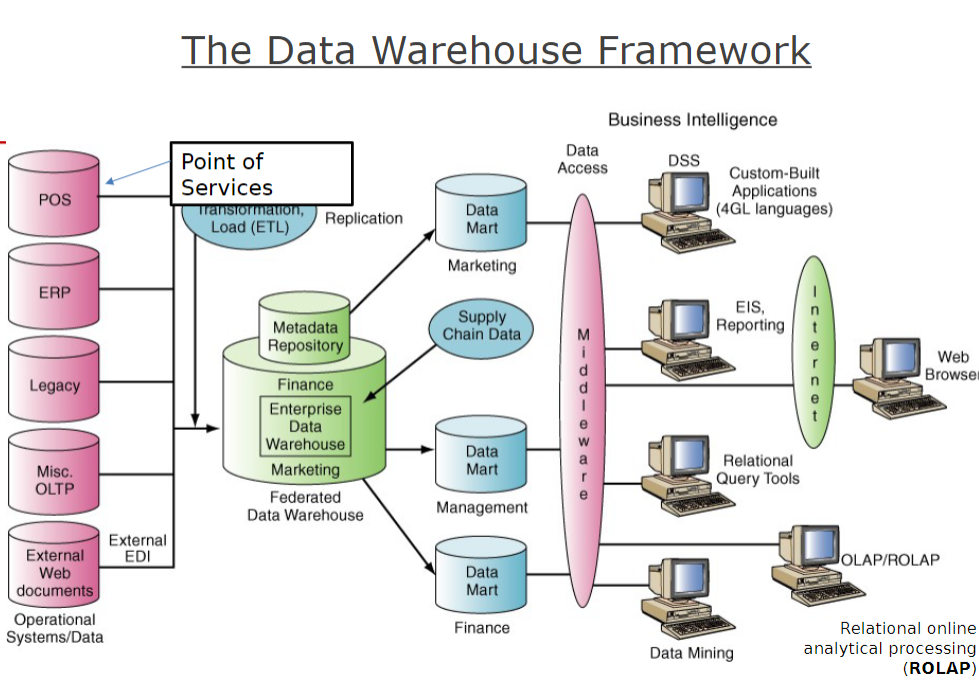

## Chapter1: Database Systems

### Database , Management systems in the Digital Age : What, Why , and How ?

#### Learning Objectives:
1. Discuss th common challenges with data management in the digital age: Why?
1. UNderstand the database approaches that can address many data managment challenges: What?
1. Discuss the data modeling of the relational database management systems(RDBMS): Why?

### Challenges in Managing Data

- The amount of data increases exponentially over time in the digital age.
> what happens in an internet minute in 2022: 90 fascinating online stats.

1. Data Sources 
- Data generated from multiple sources in the digital age:
	- **Clickstream data**: data that visitors generate when they visit a website and click on hyperlinks: User behavior and browsing patterns.
	- **Customer personal data sources**: e.g., sign up information,personal thoughts, opinions , and experiences.
	- **Internal data sources**: e.g., corporate databases and company documents.
	- **external data sources**: e.g., commercial databases, government reports, and corporate websites.

1. Data Degradation
- **Data degradation**: Gradual corruption of data due to an accumulation of non-critical failures over time.

-**Data Rot**: Physical problems with storage media that make it difficult to access data.

### Other Challenges in  managing data 

- Data security, quality , and integrity in the digital age. 
- Legal requirements change frequntly and differ among countries, industries, and cultures. 
- For example, Facebook data scandal:
>Facebook data scandal opoens new era in global privacy enforcement 
>Mark Zuckerberg apologizes for facebook's data privacy scandal

### The Database Approach: Database Management Systems(DBMS)

- A software system that is used to create, maintain , and provide controlled access to user databases.

|--------------------------------------------------------------------------------------|	
|						|				|	
|Order filing systems	|				|Central database 
|						|				|
|						|				|contains employee, order, inventory, pricing
|Invoicing systems		|	DBMS		|,and customer data		
|						|				|
|Payroll systems		|				|
							

- A software system to create , maintain , and provide controlled access to data and database.

### Database Approach:DBMS
- Minimize:
	- data redundancy
	- data isolation
	- data inconsistency 
- Maximize:
	- data security
	- data integrity
	- data independence

### Database Approach : Data Hierarchy 
- **Data**: Stored representations of meaningful objects and events in the orgizational setting.
- **Field**: A column of data containing a logical grouping of characters, e.g. , name , SSN, address, etc.
- **Record**: A logical grouping of related fields in a row.
- **Data files (Tables)**: A logical grouping of related records.
- **Database**: A logical grouping of related data files(a.k.a., database tables)
> sample college database demo.

### Relational Database Model: How?
- Entity : A person, place , thing, or event (e.g., customers, an employee, or a product)
- Relational Database Model:
	- Based on the concept of two-dimensional tables.
	- Designed with a number of related tables. 
	- Each table contains records in rows and attributes in columns
- Entity Relationship Disgram (ERD): A diagram that represents entities in a database and their relationships.

### Realtional Database Model: How?
- Primary Key :
	- A field in one table that uniquely identify each record. 
	- Used to retrieve , update , and sort data in a database.
- Foreign Key :
	- A field (or group of fields) in one table that uniquely identifies a row a another table.
	- used to establish a realtionship between two tables
- Sample College Database Demo

### Data Warehouse
- Data are collected from multiple data sources (e.g., ERP, websites, customer data, transactional IS , operational databases, etc.)
> data sources

- Data Intergration: The organization needs to ETL data from data sources into a data warehouse. 

- Data organized by subjects (e.g., customer vendor, price level, and region)
> data warehouse

> A repository of historical data that are organized by subjects to support decision making.

#### Data Market 

- A low-cost, scaled-down version of a database that is designed for needs for strategic business units or an department.

### The Data Warehouse Framework

## Summary:
1. Discuss the common challenges with data management in the digital age: why?
> 
1. understand the database approaches that can address data management challenges: what?
> 
1. Discuss the data modeling of the relational database management systems (RDBMS): how?
> 
