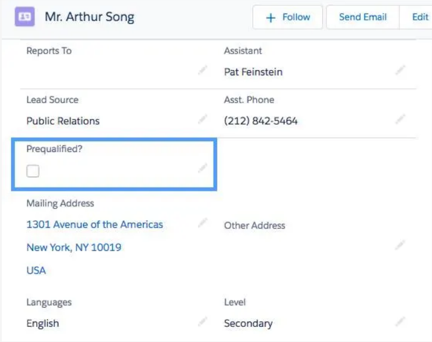
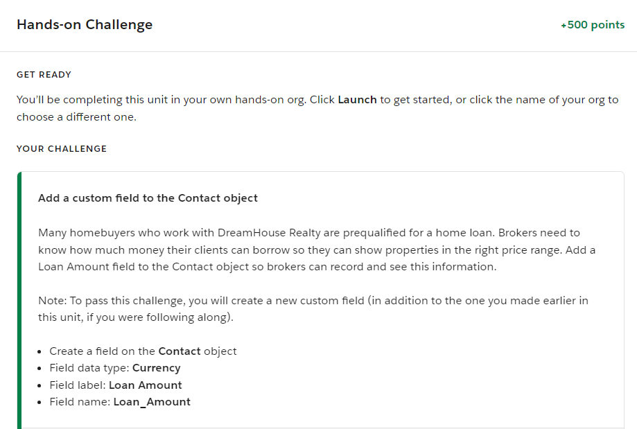

## Instruction:

- If you have not signed up or completed your profile with the Salesforce Trailhead, please follow the attached step-by-step Instructions  to do so in Canvas > Salesforce Trailhead Orientation. 
### Please sign in and use the following link to complete the Salesforce Assignment 1:
1. Your Guide to Trailhead: https://trailhead.salesforce.com/en/content/learn/modules/trailhead_basicsLinks to an external site.

1. Salesforce Platform Basics: https://trailhead.salesforce.com/en/content/learn/modules/starting_force_comLinks to an external site. 

- Once you click the first link you will begin **'Your Guide to Trailhead'** this will be a quick 5 min quiz showing what saleforce and how it is going to help you advance.

- Once you have completed the first link 'Your guide to trailhead' next you will click the second link and review 'Salesforce Platform Basics'. 

#### Learning Objectives 
- Define the salesforce Platform
- Describe the DreamHouse scenario
- Create a trailhead playground
- Explain th difference between no code (declarative) and programmatic developments 

# Salesforce Platform Basics

1. From the gear icon ( The gear icon to open Setup.), click Setup to launch the setup page. We use Setup a lot, so remember this step!
1. Click the Object Manager tab.
1. Click Contact.
1. In the Details panel, click Fields & Relationships, and then click New.
1. A data type indicates what kind of information your field holds. For this field, pick Checkbox and click Next.
1. The Field Label is what you see on the Contact page. Enter: Prequalified? and click Next.
1. Click Next again to accept the default field-level security.
1. Check the checkbox to add the new field to all the Contact Page Layouts and then click Save 

### You just customized your first object. Great job!

### Lets double check are work
- Let’s take a look at what we did. From the App Launcher ( App Launcher icon), find and select Dreamhouse. In the Dreamhouse app, click the Contacts tab. Use the arrow The list view arrow icon. to view All Contacts and click a contact name. Under the Details tab, you can see your new field. Now it’s easier for Michelle and the other brokers to log and retrieve this important piece of client information

# Your Turn ! 
- Take your time, make sure to read carefully on what is being asked. 

## NEXT UNIT : Discover use cases for the platform

- Read though the information above and take the quiz to move on.
> use CTRL + F to find the information faster (Questions may differ read slow and double check your work)

## Next UNIT : Understand the Salesforce Architecture
- Read though the information above and take the quiz. 

## Navigate Setup 
- Read though the information above and take the quiz. 

## Power up with AppExchange
- Read though the information above and take the quiz. 

# Submit your assignment in Canvas:

1. When you complete a Salesforce Trailhead assignment, you should be able to see the badge(s) and completed activities you have completed of the assignment.

1. Make a screenshot of each page showing your profile name, completed activities, and badges.

1. Copy and paste the screenshots into a Microsoft Word document; Name the Microsoft Word document as Salesforce Trailhead Assignment followed by your full name, and save it.

1. Follow the online submission instructions and submit the document in the Canvas as the evidence of you have completed the designated salesforce trailhead assignment.

1. Credit points may be deducted due to missing any said screenshots, or not following the submission instructions.
