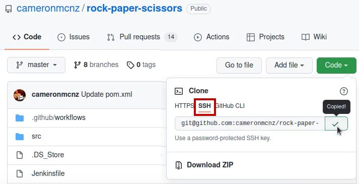

# CIT210

This GitHub project is for helping our team foster better communication through the semester. GitHub is a code hosting platform for version control and collaboration. To get started using this resource we have to do a couple of things :

- First you need to download [Git](https://git-scm.com/downloads) or [WSL](https://learn.microsoft.com/en-us/windows/wsl/install).

- Then you need to setup [git](https://www.youtube.com/watch?v=7BOrUHFu44A) or [WSL](https://www.youtube.com/watch?v=7FKi-waQuMM) to connect to GitHub.

- Next you need to setup an [SSH key](https://docs.github.com/en/authentication/connecting-to-github-with-ssh/generating-a-new-ssh-key-and-adding-it-to-the-ssh-agent) this will create a connection between your local machine and the remote repository 

> [!INFO]
> If you are using a Linux System or MacOS, you just need to do the last step.

Now that you have done all that you are ready to have some fun.

You are going to the home page for the lab repository and get the ssh link, please note the this is just a picture on where to look and not the link to the link for the repo.

  



  
  

## Using git commands

Now that you have gone through this steps above now we get it play with the git terminal.

When you get the ssh link from GitHub website you want to open your git terminal and type:

- git clone (ssh link from the repo) it will look like this

  
  

test</img>

  
  

OK so you add the new repo to your local machine you want enter it by typing: cd CIT160

  - cd stands for change directory.

  so we what to change in to the class lab created. Once inside you want to see the different files created in the class

  repo you want to type: ls

  - ls stands for list everything in the directory

-------------------------------------------------------------------------------------------------------------------------------------------------------------------------------------------

Now for the important commands "git add" ,"git status", "git commit -m 'write a note' ", "git pull", and "git push".

  - BEFORE ANYTHING TYPE: "git pull" (then press "enter")

  - If it says everything is "up-to-date"

  - we can move on

```

    git pull

    git add filename.txt

    git commit -m 'leave a message '

    git push

```

  - When we try and make changes to are .md, .txt., or some other file we have to make sure that the computer is tracking the file, for this we use the command 'git add FILENAME'

  - To make sure we are tracking the file that we want can double check by using the "git status" command. The files marked "modified" in red are NOT BEING TRACK. If you use the "git add filename"

  command and use git status again the file will turn green to show that it is being tracked.

  - Once we are tracking the file we what to finalize everything at this time. So we need to use the command "git commit -m 'some note on what you worked on'" , when you use this command you are able to save everything at a point in time in case you mess something up in the future.

  - Next we want to use the command "git pull" command to make sure that if anything is new you get the files before you send your information to the group.

  - When you have done everything and are ready to share your work you use the git push command that takes everything in the git repo on the local machine and pushes it to the Github repo on the wedsite.
