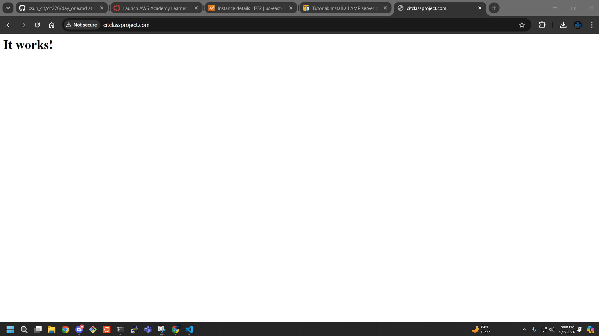
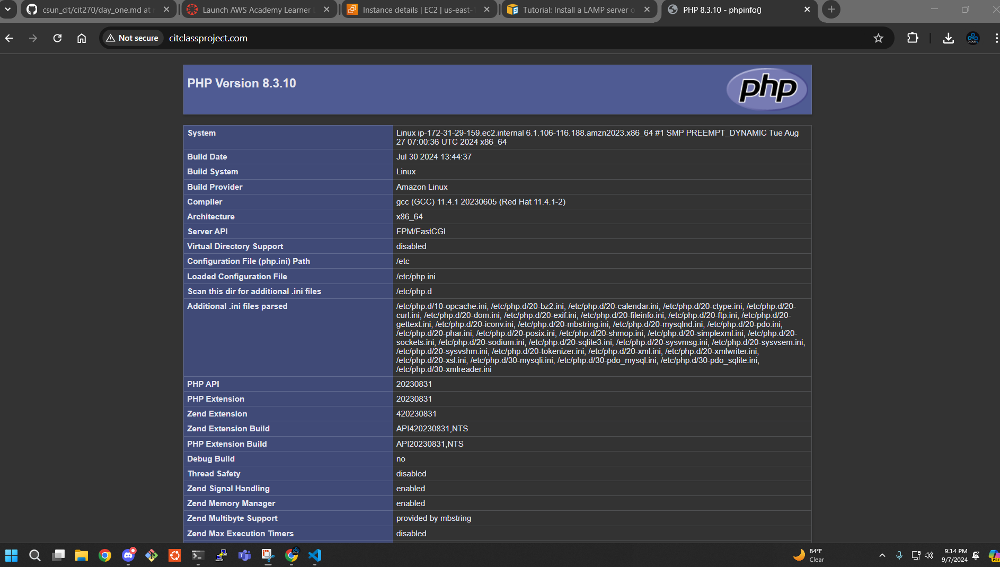

### Install a LAMP server

From last week i'm going to start will already being in the EC2 instance using DNS.

```markdown
PS C:\Users\Cameron\Downloads> ssh ec2-user@citclassproject.com -i .\labsuser.pem
   ,     #_
   ~\_  ####_        Amazon Linux 2023
  ~~  \_#####\
  ~~     \###|
  ~~       \#/ ___   https://aws.amazon.com/linux/amazon-linux-2023
   ~~       V~' '->
    ~~~         /
      ~~._.   _/
         _/ _/
       _/m/'
[ec2-user@ip-172-31-29-159 ~]$ ls
[ec2-user@ip-172-31-29-159 ~]$
```
> **MOM LOVES YOU**

For this class we used this **[website](https://docs.aws.amazon.com/linux/al2023/ug/ec2-lamp-amazon-linux-2023.html)** to get a command for are web server.

1. Open up the website above.
2. Copy 3. in To prepare the LAMP server.
> so far.
3. Paste it in the powershell instance.
```markdown
[ec2-user@ip-172-31-29-159 ~]$ sudo dnf install httpd wget php-fpm php-mysqli php-json php php-devel
```
4. Next you will be asked if you are sure you want to install all 70 packages type **y**. (for yes)
```markdown
Install  70 Packages

Total download size: 85 M
Installed size: 283 M
Is this ok [y/N]: y
```
5. To see if the service is running we are going to run a linux command **systemctl**.
```markdown
[ec2-user@ip-172-31-29-159 ~]$ sudo systemctl status httpd
```
6. Press enter
```markdown
○ httpd.service - The Apache HTTP Server
     Loaded: loaded (/usr/lib/systemd/system/httpd.service; disabled; preset: disabled)
    Drop-In: /usr/lib/systemd/system/httpd.service.d
             └─php-fpm.conf
     Active: inactive (dead)
       Docs: man:httpd.service(8)
[ec2-user@ip-172-31-29-159 ~]$
```
> **Here we can see that the service is installed but not running**
7. Now type in the last command replace status with **start**
8. If you dont get any error thats good, now rerun **status** to make sure its running.
```markdown
[ec2-user@ip-172-31-29-159 ~]$ sudo systemctl start httpd
[ec2-user@ip-172-31-29-159 ~]$ sudo systemctl status httpd
● httpd.service - The Apache HTTP Server
     Loaded: loaded (/usr/lib/systemd/system/httpd.service; disabled; preset: disabled)
    Drop-In: /usr/lib/systemd/system/httpd.service.d
             └─php-fpm.conf
     Active: active (running) since Sun 2024-09-08 04:08:35 UTC; 4s ago
       Docs: man:httpd.service(8)
   Main PID: 30272 (httpd)
     Status: "Started, listening on: port 80"
      Tasks: 177 (limit: 1112)
     Memory: 13.0M
        CPU: 45ms
     CGroup: /system.slice/httpd.service
             ├─30272 /usr/sbin/httpd -DFOREGROUND
             ├─30274 /usr/sbin/httpd -DFOREGROUND
             ├─30275 /usr/sbin/httpd -DFOREGROUND
             ├─30276 /usr/sbin/httpd -DFOREGROUND
             └─30277 /usr/sbin/httpd -DFOREGROUND

Sep 08 04:08:35 ip-172-31-29-159.ec2.internal systemd[1]: Starting httpd.service - The Apache HTTP Server...
Sep 08 04:08:35 ip-172-31-29-159.ec2.internal systemd[1]: Started httpd.service - The Apache HTTP Server.
Sep 08 04:08:35 ip-172-31-29-159.ec2.internal httpd[30272]: Server configured, listening on: port 80
[ec2-user@ip-172-31-29-159 ~]$
```
> **To double check to make sure its working search your domain for the lab you picked.**

<br>

9. Now we are going to cd into are /var/www/ and list the files inside.
> You can also type ls -l to see the permissions for the following programs
```markdown
[ec2-user@ip-172-31-29-159 www]$ ls
cgi-bin  html
[ec2-user@ip-172-31-29-159 www]$ ls -l
total 0
drwxr-xr-x. 2 root root 6 Jul 30 14:58 cgi-bin
drwxr-xr-x. 2 root root 6 Jul 30 14:58 html
```
10. Only the root user and make changes to these files we are going to change that to ec2-user. 
```markdown
[ec2-user@ip-172-31-29-159 www]$ sudo chown ec2-user html
[ec2-user@ip-172-31-29-159 www]$ ls -l
total 0
drwxr-xr-x. 2 root     root 6 Jul 30 14:58 cgi-bin
drwxr-xr-x. 2 ec2-user root 6 Jul 30 14:58 html
```
11. Now we are going to enter html directory and create a file call **index.php**
```markdown
[ec2-user@ip-172-31-29-159 www]$ cd html
[ec2-user@ip-172-31-29-159 html]$ ls
[ec2-user@ip-172-31-29-159 html]$ nano index.php
```

When nano opens up you need to type:
```
<?php
phpinfo();
?>
```
To exit this file you can press:
1. Press **CTRL+X**
2. Save modified buffer? **y**
3. Press **Enter** 
> **To see if you're successful this should be your webpage when you search your domain or reload that page. This is the end of lab 2.**

