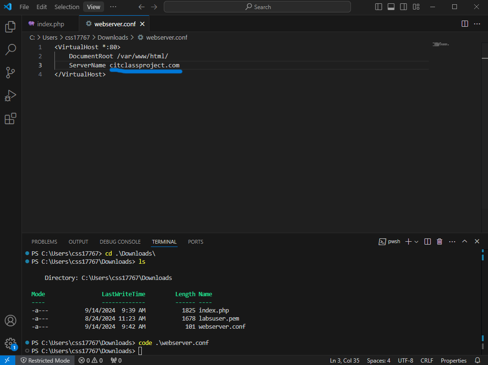
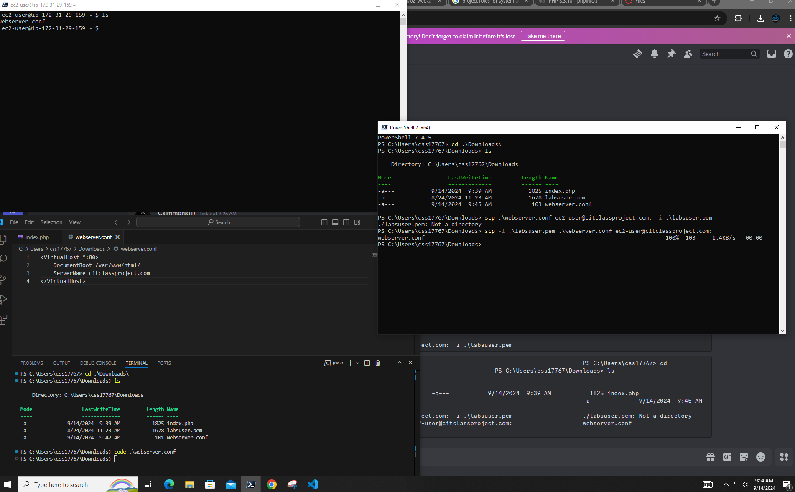
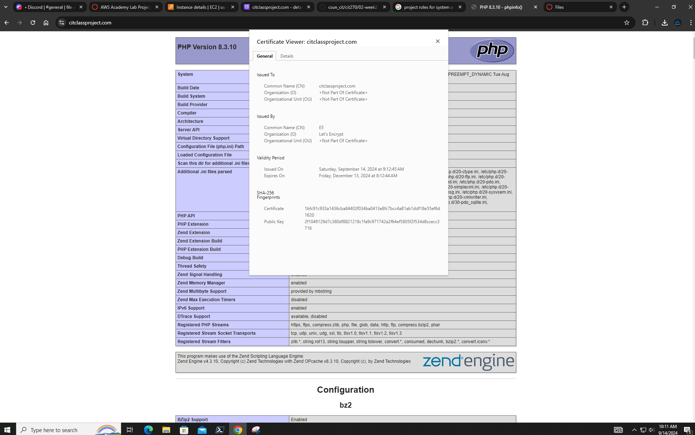
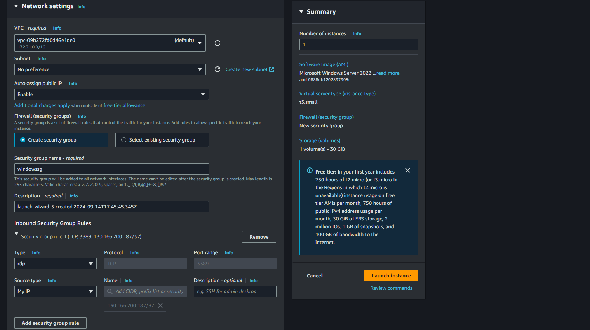
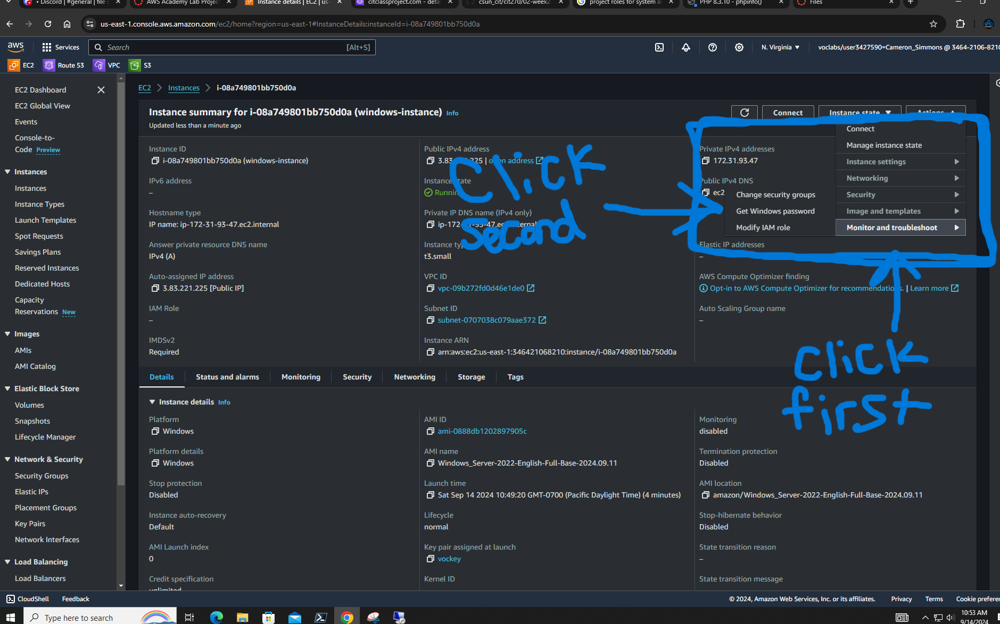
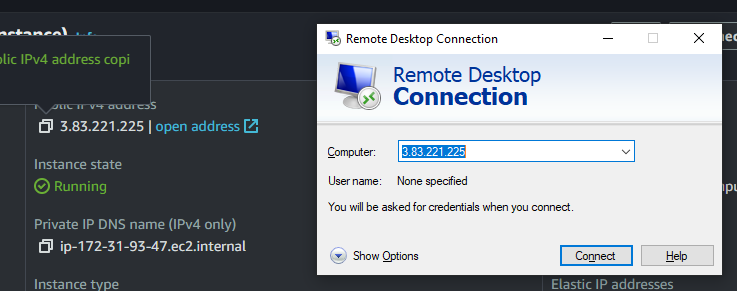
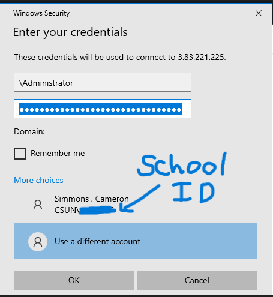
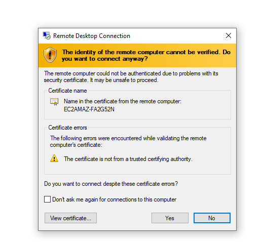

## Setting up website certificate 


### Check list:
1. Lauch aws 
2. Change A record 
3. Open Webpage with you domain name
4. If the page doesnt load check services make sure httpd is running
5. If its not running start the service
If you would like the service to run when it comes on in the future so you done have to start the httpd service everytime use with command
```markdown
[ec2-user@ip-172-31-29-159 html]$ sudo systemctl enable httpd

Created symlink /etc/systemd/system/multi-user.target.wants/httpd.service → /usr/lib/systemd/system/httpd.service.      
[ec2-user@ip-172-31-29-159 html]$ 
```

##### If everything is working move to Canvas Conf
---------------------------------------------------------------------

### Canvas Conf
1. Open you student canvas page **not** the AWS canvas.
2. Once in canvas click on files.
3. Download **webserver.conf**.<!--file is 101 bytes-->
4. Open the file in whatever text editor you have(for this example im using VScode).
5. Change the wording infront of **ServerName** to your domain and save the file.


<br> 

### Transferring file to Server form windows
1. Make sure you are in the same directory as the the **webserver.conf**.

```mardown
PowerShell 7.4.5                                                                                                        
PS C:\Users\css17767> cd .\Downloads\                                                                                   
PS C:\Users\css17767\Downloads> ls                                                                                                                                                                                                                  
Directory: C:\Users\css17767\Downloads                                                                                                                  
Name                       Mode                 LastWriteTime         Length 
----                       ----                 -------------         ------ 
index.php                  -a---           9/14/2024  9:39 AM           1825         
labsuser.pem               -a---           8/24/2024 11:23 AM          11678         
webserver.conf             -a---           9/14/2024  9:45 AM            103                                 

------------------------------------------------------------------------------------------------------------------------- 
```
2. Now use the **scp** command (This means "secure copy")
3. Use the command below and hit enter:

```markdown                                            
PS C:\Users\css17767\Downloads> scp -i .\labsuser.pem .\webserver.conf ec2-user@citclassproject.com:                    
webserver.conf                                                                        100%  103     1.4KB/s   00:00     
PS C:\Users\css17767\Downloads>
```

<br> 

4. Now go to your linux machine.
5. Type "cd" and hit enter.
6. Now type "ls" and confirm you have the file on your linux device.

```markdown
[ec2-user@ip-172-31-29-159 ~]$ ls                                                                                       
webserver.conf 
```
7. Now make a copy of the file in the conf.d directory.
8. Call it whatever you would like when you make a copy mine is "citclassproject.conf".
9. Once the file is there restart the "httpd" service.
```markdown
[ec2-user@ip-172-31-29-159 ~]$ sudo cp webserver.conf /etc/httpd/conf.d/                                                
[ec2-user@ip-172-31-29-159 ~]$ sudo cp webserver.conf /etc/httpd/conf.d/citclassproject.conf                            
[ec2-user@ip-172-31-29-159 ~]$
[ec2-user@ip-172-31-29-159 conf.d]$ ls                                                                                  
README  autoindex.conf  citclassproject.conf  php.conf  userdir.conf  welcome.conf                                      
[ec2-user@ip-172-31-29-159 conf.d]$ sudo systemctl restart httpd
```


### Setting up Certbot

1. Type the command "sudo dnf install certbot certbot-apache" and hit enter.

```markdown
=======
Transaction Summary                                                                                                   ======================================================================================================================
Install  13 Packages                                                                                                                                                                                                                        Total download size: 2.0 M                                                                                            
Installed size: 9.0 M                                                                                                 
Is this ok [y/N]: N                                                                                                   
Operation aborted.                                                                                                    
[ec2-user@ip-172-31-29-159 conf.d]$ sudo dnf install certbot certbot-apache                                           
Last metadata expiration check: 1:07:06 ago on Sat Sep 14 16:00:13 2024.                                              
Dependencies resolved.                                                                                                ====================================================================================================================== 
Package                           Architecture      Version                             Repository              Size ======================================================================================================================
Installing:                                                                                                            
certbot                           
noarch            2.6.0-4.amzn2023.0.1                amazonlinux             49 k  
python3-certbot-apache            noarch            2.6.0-4.amzn2023.0.1                amazonlinux            287 k Installing dependencies:                                                                                               augeas-libs                       x86_64            1.13.0-1.amzn2023.0.2               amazonlinux            408 k  fontawesome-fonts                 noarch            1:4.7.0-11.amzn2023.0.2             amazonlinux            205 k  fonts-filesystem                  noarch            1:2.0.5-12.amzn2023.0.2             amazonlinux            9.5 k  mod_ssl                           x86_64            1:2.4.62-1.amzn2023                 amazonlinux            112 k  python3-acme                      noarch            2.6.0-4.amzn2023.0.1                amazonlinux            161 k  python3-augeas                    noarch            1.1.0-10.amzn2023                   amazonlinux             34 k  python3-certbot                   noarch            2.6.0-4.amzn2023.0.1                amazonlinux            677 k  python3-configargparse            noarch            1.7-1.amzn2023                      amazonlinux             45 k  python3-josepy                    noarch            1.13.0-6.amzn2023                   amazonlinux             61 k  python3-parsedatetime             noarch            2.6-10.amzn2023                     amazonlinux             80 k  python3-pyOpenSSL                 noarch            21.0.0-1.amzn2023.0.2               amazonlinux             92 k  python3-pyrfc3339                 noarch            1.1-16.amzn2023                     amazonlinux             19 k  sscg                              x86_64            3.0.3-76.amzn2023                   amazonlinux             45 k Installing weak dependencies:                                                                                          python-josepy-doc                 noarch            1.13.0-6.amzn2023                   amazonlinux             20 k                                                                                                                       Transaction Summary                                                                                                   ======================================================================================================================
Install  16 Packages                                                                                                                                                                                                                        Total download size: 2.3 M                                                                                            
Installed size: 9.5 M                                                                                                 
Is this ok [y/N]: y                                                                                                   
Downloading Packages:                                                                                                 
(1/16): certbot-2.6.0-4.amzn2023.0.1.noarch.rpm                                       983 kB/s |  49 kB     00:00     
(2/16): augeas-libs-1.13.0-1.amzn2023.0.2.x86_64.rpm                                  6.8 MB/s | 408 kB     00:00     
(3/16): fontawesome-fonts-4.7.0-11.amzn2023.0.2.noarch.rpm                            2.7 MB/s | 205 kB     00:00     
(4/16): fonts-filesystem-2.0.5-12.amzn2023.0.2.noarch.rpm                             369 kB/s | 9.5 kB     00:00     
(5/16): mod_ssl-2.4.62-1.amzn2023.x86_64.rpm                                          3.4 MB/s | 112 kB     00:00     
(6/16): python-josepy-doc-1.13.0-6.amzn2023.noarch.rpm                                901 kB/s |  20 kB     00:00     
(7/16): python3-acme-2.6.0-4.amzn2023.0.1.noarch.rpm                                  5.9 MB/s | 161 kB     00:00     
(8/16): python3-augeas-1.1.0-10.amzn2023.noarch.rpm                                   1.4 MB/s |  34 kB     00:00     
(9/16): python3-configargparse-1.7-1.amzn2023.noarch.rpm                              1.9 MB/s |  45 kB     00:00     
(10/16): python3-certbot-2.6.0-4.amzn2023.0.1.noarch.rpm                               13 MB/s | 677 kB     00:00     
(11/16): python3-certbot-apache-2.6.0-4.amzn2023.0.1.noarch.rpm                       5.1 MB/s | 287 kB     00:00     
(12/16): python3-josepy-1.13.0-6.amzn2023.noarch.rpm                                  2.5 MB/s |  61 kB     00:00     
(13/16): python3-parsedatetime-2.6-10.amzn2023.noarch.rpm                             3.4 MB/s |  80 kB     00:00     
(14/16): python3-pyrfc3339-1.1-16.amzn2023.noarch.rpm                                 761 kB/s |  19 kB     00:00     
(15/16): python3-pyOpenSSL-21.0.0-1.amzn2023.0.2.noarch.rpm                           2.1 MB/s |  92 kB     00:00     
(16/16): sscg-3.0.3-76.amzn2023.x86_64.rpm                                            2.0 MB/s |  45 kB     00:00     ----------------------------------------------------------------------------------------------------------------------
Total                                                                                 8.9 MB/s | 2.3 MB     00:00     
Running transaction check                                                                                             
Transaction check succeeded.                                                                                          
Running transaction test                                                                                              
Transaction test succeeded.                                                                                           
Running transaction                                                                                                     
Preparing        :                                                                                              
1/1   Installing       : python3-pyrfc3339-1.1-16.amzn2023.noarch                                                    
1/16   Installing       : python3-pyOpenSSL-21.0.0-1.amzn2023.0.2.noarch                                              
2/16   Installing       : sscg-3.0.3-76.amzn2023.x86_64                                                               
3/16   Installing       : mod_ssl-1:2.4.62-1.amzn2023.x86_64                                                          
4/16   Installing       : python3-parsedatetime-2.6-10.amzn2023.noarch                                                
5/16   Installing       : python3-configargparse-1.7-1.amzn2023.noarch                                                
6/16   Installing       : python-josepy-doc-1.13.0-6.amzn2023.noarch                                                  
7/16   Installing       : python3-josepy-1.13.0-6.amzn2023.noarch                                                     
8/16   Installing       : python3-acme-2.6.0-4.amzn2023.0.1.noarch                                                    
9/16   Installing       : python3-certbot-2.6.0-4.amzn2023.0.1.noarch                                                
10/16   Installing       : fonts-filesystem-1:2.0.5-12.amzn2023.0.2.noarch                                            
11/16   Installing       : fontawesome-fonts-1:4.7.0-11.amzn2023.0.2.noarch                                           
12/16   Installing       : augeas-libs-1.13.0-1.amzn2023.0.2.x86_64                                                   
13/16   Installing       : python3-augeas-1.1.0-10.amzn2023.noarch                                                    
14/16   Installing       : python3-certbot-apache-2.6.0-4.amzn2023.0.1.noarch                                         
15/16   Installing       : certbot-2.6.0-4.amzn2023.0.1.noarch                                                        
16/16   Running scriptlet: certbot-2.6.0-4.amzn2023.0.1.noarch                                                        
16/16                                                                                                                       
Certbot auto renewal timer is not started by default.                                                                 
Run 'systemctl start certbot-renew.timer' to enable automatic renewals.                                                                                                                                                                       
        Verifying        : augeas-libs-1.13.0-1.amzn2023.0.2.x86_64                                                    
1/16    Verifying        : certbot-2.6.0-4.amzn2023.0.1.noarch                                                         
2/16    Verifying        : fontawesome-fonts-1:4.7.0-11.amzn2023.0.2.noarch                                            
3/16    Verifying        : fonts-filesystem-1:2.0.5-12.amzn2023.0.2.noarch                                             
4/16    Verifying        : mod_ssl-1:2.4.62-1.amzn2023.x86_64                                                          
5/16    Verifying        : python-josepy-doc-1.13.0-6.amzn2023.noarch                                                  
6/16    Verifying        : python3-acme-2.6.0-4.amzn2023.0.1.noarch                                                    
7/16    Verifying        : python3-augeas-1.1.0-10.amzn2023.noarch                                                     
8/16    Verifying        : python3-certbot-2.6.0-4.amzn2023.0.1.noarch                                                 
9/16    Verifying        : python3-certbot-apache-2.6.0-4.amzn2023.0.1.noarch                                         
10/16   Verifying        : python3-configargparse-1.7-1.amzn2023.noarch                                               
11/16   Verifying        : python3-josepy-1.13.0-6.amzn2023.noarch                                                    
12/16   Verifying        : python3-parsedatetime-2.6-10.amzn2023.noarch                                               
13/16   Verifying        : python3-pyOpenSSL-21.0.0-1.amzn2023.0.2.noarch                                             
14/16   Verifying        : python3-pyrfc3339-1.1-16.amzn2023.noarch                                                   
15/16   Verifying        : sscg-3.0.3-76.amzn2023.x86_64                                                              
16/16                                                                                                                       
Installed:                                                                                                              
augeas-libs-1.13.0-1.amzn2023.0.2.x86_64                 
certbot-2.6.0-4.amzn2023.0.1.noarch                          
fontawesome-fonts-1:4.7.0-11.amzn2023.0.2.noarch         
fonts-filesystem-1:2.0.5-12.amzn2023.0.2.noarch              
mod_ssl-1:2.4.62-1.amzn2023.x86_64                       
python-josepy-doc-1.13.0-6.amzn2023.noarch                   
python3-acme-2.6.0-4.amzn2023.0.1.noarch                 
python3-augeas-1.1.0-10.amzn2023.noarch                      
python3-certbot-2.6.0-4.amzn2023.0.1.noarch              
python3-certbot-apache-2.6.0-4.amzn2023.0.1.noarch           
python3-configargparse-1.7-1.amzn2023.noarch             
python3-josepy-1.13.0-6.amzn2023.noarch                      
python3-parsedatetime-2.6-10.amzn2023.noarch             
python3-pyOpenSSL-21.0.0-1.amzn2023.0.2.noarch               
python3-pyrfc3339-1.1-16.amzn2023.noarch                 
sscg-3.0.3-76.amzn2023.x86_64                                                                                                                                                    
Complete!                                       
```
2. Next use this command: "sudo certbot" and hit enter.
3. You will get this Error dont panic rerun the command "sudo certbot" and hit enter.

```markdown 
[ec2-user@ip-172-31-29-159 conf.d]$ sudo certbot                                                                      
Saving debug log to /var/log/letsencrypt/letsencrypt.log                                                              
Error while running apachectl configtest.                                                                                                                                                                                                   
AH00526: Syntax error on line 101 of /etc/httpd/conf.d/ssl.conf:                                                      
SSLCertificateFile: file '/etc/pki/tls/certs/localhost.crt' does not exist or is empty                                                                                                                                                     
Exiting due to user request.
```

4. Fill out the infomation needed.

```markdown
[ec2-user@ip-172-31-29-159 conf.d]$ sudo certbot                                                                      
Saving debug log to /var/log/letsencrypt/letsencrypt.log                                                              
Enter email address (used for urgent renewal and security notices)                                                     
(Enter 'c' to cancel): <Your email> 
- - - - - - - - - - - - - - - - - - - - - - - - - - - - - - - - - - - - - - - -                                       
Please read the Terms of Service at                                                                                   
https://letsencrypt.org/documents/LE-SA-v1.4-April-3-2024.pdf. You must agree in                                      
order to register with the ACME server. Do you agree?                                                                 
- - - - - - - - - - - - - - - - - - - - - - - - - - - - - - - - - - - - - - - -                                       
(Y)es/(N)o: y                                                                                                                                                                                                                               
- - - - - - - - - - - - - - - - - - - - - - - - - - - - - - - - - - - - - - - -                                       
Would you be willing, once your first certificate is successfully issued, to                                          
share your email address with the Electronic Frontier Foundation, a founding                                          
partner of the Let's Encrypt project and the non-profit organization that                                             
develops Certbot? We'd like to send you email about our work encrypting the web,                                     
EFF news, campaigns, and ways to support digital freedom.                                                             
- - - - - - - - - - - - - - - - - - - - - - - - - - - - - - - - - - - - - - - -                                       
(Y)es/(N)o: y                                                                                                        
Account registered.                                                                                                                                                                                                                         
Which names would you like to activate HTTPS for?                                                                     
We recommend selecting either all domains, or all domains in a VirtualHost/server block.                              
- - - - - - - - - - - - - - - - - - - - - - - - - - - - - - - - - - - - - - - -                                       
1: citclassproject.com <-- YOUR DOMAIN                                                                                                
- - - - - - - - - - - - - - - - - - - - - - - - - - - - - - - - - - - - - - - -                                       
Select the appropriate numbers separated by commas and/or spaces, or leave input                                      
blank to select all options shown (Enter 'c' to cancel):
                                        
Requesting a certificate for citclassproject.com                                                                                                                                                                                            
Successfully received certificate.                                                                                    
Certificate is saved at: /etc/letsencrypt/live/citclassproject.com/fullchain.pem                                      
Key is saved at:         /etc/letsencrypt/live/citclassproject.com/privkey.pem                                        
This certificate expires on 2024-12-13.                                                                               
These files will be updated when the certificate renews.                                                              
Certbot has set up a scheduled task to automatically renew this certificate in the background.                                                                                                                                              
Deploying certificate                                                                                                 
Successfully deployed certificate for citclassproject.com to /etc/httpd/conf.d/citclassproject-le-ssl.conf            
Congratulations! You have successfully enabled HTTPS on https://citclassproject.com                                                                                                                                                         
- - - - - - - - - - - - - - - - - - - - - - - - - - - - - - - - - - - - - - - -                                       
If you like Certbot, please consider supporting our work by:                                                           
* Donating to ISRG / Let's Encrypt:   https://letsencrypt.org/donate                                                  
* Donating to EFF:                    https://eff.org/donate-le                                                      
- - - - - - - - - - - - - - - - - - - - - - - - - - - - - - - - - - - - - - - -                                       
[ec2-user@ip-172-31-29-159 conf.d]$
```

5. Check to make sure your webpage is now secure by seeing if the certificate is valid.


<br> 

6. You are done.

## This was an end of class special ↓
### Launch windows instance
1. Create a new instance in EC2
2. Name is something you can tell your linux machine from your windows
3. Change OS image from "Amazon Linux" to "Windows"
4. Make sure its Amazon machine image (Microsoft Windows Server 2022 base)
5. Instance Type : t3.small
6. Keypair : vockey <-- will change in class cant remember the name.
7. Make sure your next work settings match:


<br> 

8. Launch instance
9. How click "Actions","Monitor and troubleshoot",and finally "Get windows password".


<br> 

10. You will get a new window pop up called "Get Windows password".
11. Copy the password string and paste it somewhere to comeback to it.
12. Now open "Remote Desktop Connection" 
13. In the Computer : <Paste instance ip>


<br> 

14. Paste your password string in and make the picture below match for your information ↓


<br> 

15. After you hit enter you should see the "Remote desktop connection" tell you "A connection is made but not verified Do you want to connect anyway?"


<br> 

> End of lab 9/14/2024
