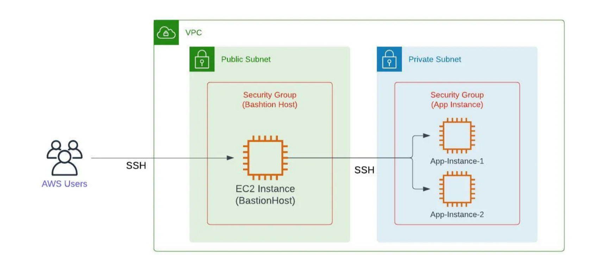

### Setting up Virtual Private Cloud
*The image below is a visual aid on the project we are going to work on today*



#### Make a VPC
1. Go to VPC
2. Create "VPC"
3. Name: vpc-test
4. In the box for IPv4 CIDR type: 10.10.0.0/16 (This is what i used for my example)
5. Move to IPv6 CIDR block click: Amazon-provided IPv6 CIDR block
6. Finally click "Create VPC"
<br>
<!--
#### Creating a subnet for VPC
1. Click "Create Subnet"
2. Select the vpc you created example mine: 10.10.0.0/16
3. Subnet name: a-vpc-subnet
4. In availability zones match the zone with subnet name example: us-east-1a
5. Now in IPv4 VPC CIDR block type: 10.10.10.0
6. Click on add new subnet and repeat steps 3-5 but with the IPv4 VPC CIDR block I increased the 3rd octet each time I made a new subnet.
7. Once you run out of availability zones
8. Click "Create subnet"
*You will have 6 different subnets but the end of this*
9. Edit subnet b,d,and f by clicking action
10. Click edit subnet settings
11. Check "Enable auto assign public IPv4 address" for these three subnets
12. Then click save
#### Creating a internat gateway
1. Click "Create internet gateway"
2. Name: vpc-test-gateway
3. Click "Create Internet gateway"
4. Click the top "Attach to a VPC"
5. Click the box with the search icon
6. Click the give VPC (AWS is smart and knows to show only the VPC without gateways)
7. Click "Attach internet gateway"
#### Open route to the internet
*Here we need to finalize the connection to are gateway*
<br>

1. Click on "Your VPC"
2. Click on "You VPC you made"
3. Click on "The Route tables"
4. Click on "Edit route"
<br>

<br>
5. Click on "Add route"
6. Click the first one "0.0.0.0/0"
7. Click the bar next to it on right and select "Internet gateway"
8. Under that click bar and select "internet gateway"
9. Save change

#### Setting up Bastion Host
*Here we will use one instance to connect to are private network instance*
1. Open EC2
2. Create an instance 
3. name: "vpc-wan"
4. Keep OS AWS linux and change architecture to "arm"
5. Keypair: vockey
***IMPORTANT***
6. Scroll down and click edit on Network settings
7. Change the VPC to one you made
8. Subnet use type b (*This will auto assign an ip-address*)
9. Security Group Name: vpc-wan-test
10. Scroll down a little and click on "Source Type": **My IP**
11. Launch Instance
*If you have two ip addresses one public, one private and can ping "google" move on to setting up the second machine*
#### Setting up Private subnet
1. Open EC2
2. Create an instance 
3. name: "vpc-lan"
4. Keep OS AWS linux and change architecture to "arm"
5. Keypair: vockey
***IMPORTANT***
6. Scroll down and click edit on Network settings
7. Change the VPC to one you made
8. Subnet use type a (*This will auto assign an ip-address*)
9. Security Group Name: vpc-wan-test
10. Scroll down a little and click on "Source Type": **Anywhere**
11. Launch Instance
#### Coping Over Key for instance
1. Open powershell in windows
2. cd Downloads
3. Type dir and enter
4. If you see labusers.pem thats what we want
5. Now type ``` scp -i .\labuser.pem .\labuser.pem ec2-user@<vpc-wan public ip>
6. Enter the out put should be the file name on the left and 100 on the right.
7. Now ssh in to your vpc-wan instance
8. Once in type "ls"*Here you should see the labuser.pem file*
9. Next type chmod 400 labuser.pem and enter
10. Finally ssh into your vpc-lan instance
-->
*The below code block shows you that im signing into my aws linux wan instance then from there I can ssh into my private network. I don't know if it looks right but I hope you get the idea*
```
PS C:\Users\css17767\Downloads> ssh ec2-user@44.204.121.144 -i .\labsuser.pem
The authenticity of host '44.204.121.144 (44.204.121.144)' can't be established.
ECDSA key fingerprint is SHA256:                                            
Are you sure you want to continue connecting (yes/no/[fingerprint])? yes                                                
Warning: Permanently added '44.204.121.144' (ECDSA) to the list of known hosts.
                                            
(vpc-wan)                                                                                                      
[ec2-user@ip-10-10-10-167 ~]$ ping google.com                                                                           
PING google.com (172.253.63.113) 56(84) bytes of data.                                                                  
64 bytes from bi-in-f113.1e100.net (172.253.63.113): icmp_seq=1 ttl=105 time=1.68 ms                                    
64 bytes from bi-in-f113.1e100.net (172.253.63.113): icmp_seq=2 ttl=105 time=1.72 ms                                    
64 bytes from bi-in-f113.1e100.net (172.253.63.113): icmp_seq=3 ttl=105 time=1.73 ms                                    
64 bytes from bi-in-f113.1e100.net (172.253.63.113): icmp_seq=4 ttl=105 time=1.73 ms                                    
--- google.com ping statistics ---                                                                                      
4 packets transmitted, 4 received, 0% packet loss, time 3005ms                                                          
rtt min/avg/max/mdev = 1.679/1.711/1.727/0.019 ms

(vpc-wan) 
[ec2-user@ip-10-10-10-167 ~]$ ssh ec2-user@10.10.0.4 -i .\labsuser.pem
The authenticity of host '10.10.10.167 (10.10.10.167)' can't be established.
ECDSA key fingerprint is SHA256: .                                            
Are you sure you want to continue connecting (yes/no/[fingerprint])? yes                                                
Warning: Permanently added '10.10.10.167' (ECDSA) to the list of known hosts.

(vpc-lan)
[ec2-user@ip-10-10-0-4 ~]$ MOM LOVES YOU
```
> End of lab 10/5/2024
