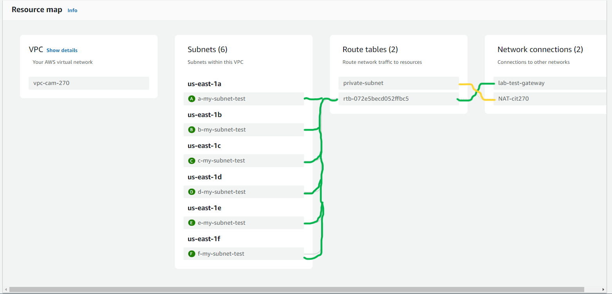

### Create a peer connection


<br>

> [!CAUTION]
> File not done still working on.

> [!IMPORTANT]
> Before moving forward make sure you can connect to both VPC instance you created. You can do this my connecting to the one that has a public IP once inside the machine try connecting to the second one.
> 
> Please note B is public and A is a private network only can access through B (Think of this as a bastion host)
> 
> **First machine B** ``` ssh ec2-user@PublicIP -i .\labsuser.pem ```
> 
> **Second machine A** ```ssh -i ./labsuser.pem PrivateIP ```

#### Create a NAT gateway
1. Load up your lab once in go to NAT gateway
2. Create a NAT gateway
3. name: NAT-cit270
4. Subnet: PICK THE SUBNET PUBLIC IP
5. Communication type: public 
6. Elastic IP allocation ID: Click on allocate Elastic IP
7. Click on create NAT gateway

#### Create a Route table
1. Go to VPC 
2. Click on route tables
3. Click on create a route table
4. Name: private-subnet
5. VPC: Click on the VPC you created **NOT DEFAULT**
6. On the route table you just created you are going to edit the route
7. Add route: Destionation: 0.0.0.0/0 | Target: NAT-cit270
8. Save


<br>

> Here we have the route table setup and are NAT gateway setup now its time for us to connect them to the subnet A,C,E

#### Connection subnet to private-subnet
> We will only mess with A, C, E subnets
1. Go to subnets click on **A-subnet** you created though VPC.
2. Click on the **Route table** and edit it


<br>

3. Save the route table association
4. Repeat for C and E subnets

Final result should look like this.
> Please not it the time I got this wrong and used F and not E I have fixed this.


Test the connection by sshing into your VPC device you created last week. You will ssh into your **public VPC** and then ssh into your **private VPC**.We are testing if you can get outside are private network we created. 

Example:
```
PS C:\Users\user\Downloads> ssh ec2-user@publicIP -i .\labsuser.pem
The authenticity of host 'publicIP (publicIP)' can't be established.
ED25519 key fingerprint is SHA256
This key is not known by any other names.
Are you sure you want to continue connecting (yes/no/[fingerprint])? yes
Warning: Permanently added 'publicIP' (ED25519) to the list of known hosts.

A newer release of "Amazon Linux" is available.
  Version 2023.6.20241010:
Run "/usr/bin/dnf check-release-update" for full release and version update info
   ,     #_
   ~\_  ####_        Amazon Linux 2023
  ~~  \_#####\
  ~~     \###|
  ~~       \#/ ___   https://aws.amazon.com/linux/amazon-linux-2023
   ~~       V~' '->
    ~~~         /
      ~~._.   _/
         _/ _/
       _/m/'

[ec2-user@ip-10-10-10-167 ~]$ ssh -i ./labsuser.pem 10.10.0.4
   ,     #_
   ~\_  ####_        Amazon Linux 2023
  ~~  \_#####\
  ~~     \###|
  ~~       \#/ ___   https://aws.amazon.com/linux/amazon-linux-2023
   ~~       V~' '->
    ~~~         /
      ~~._.   _/
         _/ _/
       _/m/'
Last login: Sat Oct  5 18:44:04 2024 from 10.10.10.167
[ec2-user@ip-10-10-0-4 ~]$
```
Now that we are in we are going to use the command ```curl``` to see if we get a response.  
```
[ec2-user@ip-10-10-0-4 ~]$ curl google.com
<HTML><HEAD><meta http-equiv="content-type" content="text/html;charset=utf-8">
<TITLE>301 Moved</TITLE></HEAD><BODY>
<H1>301 Moved</H1>
The document has moved
<A HREF="http://www.google.com/">here</A>.
</BODY></HTML>
[ec2-user@ip-10-10-0-4 ~]$
```
Here you can see we got a response and it works. You can also try and ping google to see if you get a response, and you should get one back.
<!--

```
[ec2-user@ip-10-10-10-167 ~]$ sudo mkdir /efs 
[ec2-user@ip-10-10-10-167 ~]$ cd /
[ec2-user@ip-10-10-10-167 /]$ ls 
bin  boot  dev  efs  etc  home  lib  lib64  local  media  mnt  opt  proc  root  run  sbin  srv  sys  tmp  usr  var
[ec2-user@ip-10-10-10-167 /]$   
```


```[ec2-user@ip-10-10-10-167 /]$ sudo dnf install amazon-efs-utils ```
-->
