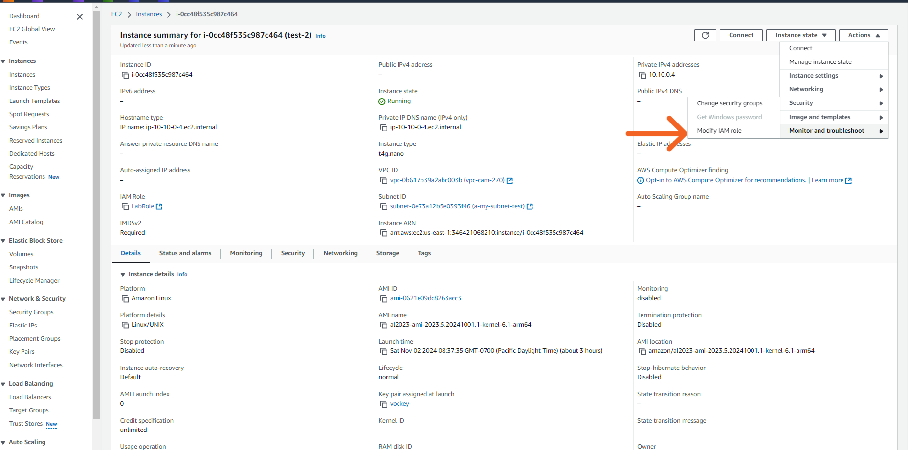
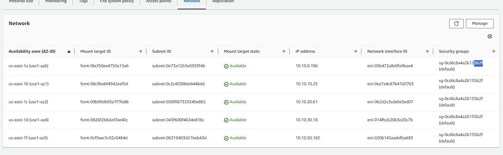
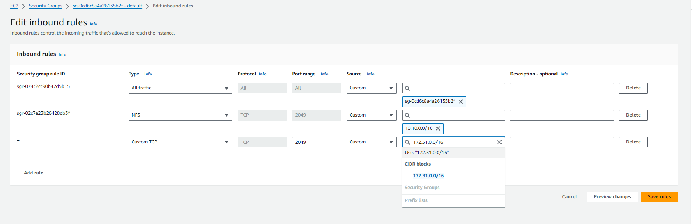

### EFS 
<!--#!115 reruns command on that line-->
AWS install botocore

> [!IMPORTANT]
> Make sure you have your two instance you create with your VPC

### Creating a EFS 
1. search click EFS
2. Click on file system
3. Create file system
    - Name: CAM-file-system
    - Virtual private cloud: pick the **non default**
    - Create
4. Click view details
5. Attach
6. If using amazon linux under **Using the EPS mount helper** use the first option 
7. Open two terminals for different instances **Your public and private instance you created**

*Lets go are work in the private*
### Mounting the EFS 
*Get into your private instance for example mine is 10.10.0.4*
 
1. ```cd /```
2. ```sudo mkdir:efs```
3. ```sudo dnf update```
4. ```sudo dnf upgrade```
5. ```sudo dnf install wget```
6. ```sudo wget https://bootstrap.pypa.io/get-pip.py -O /tmp/get-pip.py```
7. ```sudo python3 /tmp/get-pip.py```
8. ```sudo pip3 install botocore || sudo /usr/local/bin/pip3 install botocore```
9. ```sudo pip3 install botocore --upgrade```
10. ```sudo sed -i -e '/\[cloudwatch-log\]/{N;s/# enabled = true/enabled = true/}'```
11. ```sudo dnf install amazon-efs-utils -y```
12. Modify the IAM rules in your private instance by click the arrow and selecting **"LabInstanceProfile"**




13. Now we need to change the security group for are subnet in this case im using **subnet a**(Find the one you are using)



14. For me I want the **5b2f** security group
15. On the right click on **Secuirty group**
16. You want the security group for the private network you're working in. Example mine is for my-subnet-a
17. Here we will change the inbound rules.



*I think that should be everything to mount the efs*

12. ```sudo mount -t efs -o tls fs-091b8bea569d9407e:/ /efs```
*Once you have finished and you got EFS to mount on your private machine put it on your public machine though the setups above. You want the public instance you use to sign into the private instance.*

Now we want to test to see if we can store data in here we are going to use the logo.png from are s3 bucket.
13. cd /
14. ll 

Efs is only right able by root we are going to change the permissions

15. sudo chmod 777 efs/ *This changes the permission roles for this directory*

16. Go to the s3 bucket that has the logo.png.
17. Click the check mark next to the logo.png 
18. Once highlighted click on "Copy S3 URL"
19. ```aws s3 cp <paste url> /efs```
20. Now go to another machine that has efs to see if the logo.png is there.


This completes the EFS lab 
9/26/2024