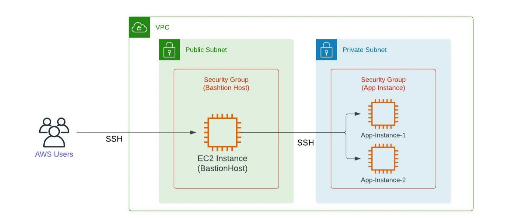
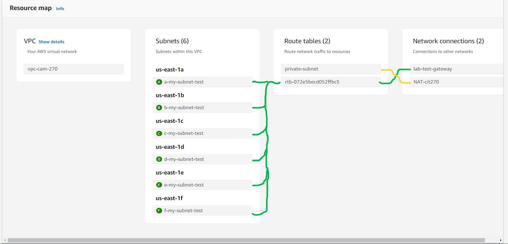
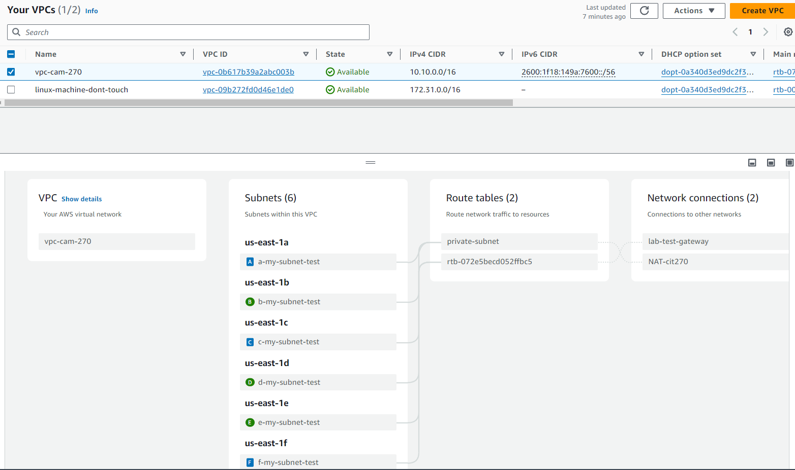

## Making your private network reach the outside

> [!IMPORTANT]
> Make sure you have completed week6 and week7 to move forward <br>
> Make sure to start and stop your RDS<br>
> Make sure both instance for VPC are running you want the **public IP** and **private IP**

### Make sure you can sign to both instances
1. Get the IP for your public instance for this example this is mine: ```3.231.208.2```
2. Now ssh into the instance: ```ssh ec2-user@3.231.208.2 -i .\labsuser.pem```
3. Once in you are going to ssh into the private instance: ```ssh -i ./labsuser.pem 10.10.0.4```


*This is what we just did we are accessing a private network from are bastion host*

<br>

*If you try to ping 8.8.8.8 or 8.8.4.4 you will see that you can not ping out in this lab we are going to change that.*

<Add image >

### Creating a NAT gateway
1. Lets go to the VPC
2. Once on the VPC page on the left click on NAT gateway
3. Create a NAT gateway
    - Name: **CAM-NAT-gateway**
    - Subnet: **Pick one that is a public subnet [b,d,f]**
    - Elastic IP allocation: Click on **Allocate Elastic IP**
    - Create NAT gateway

### Create a route table
1. On the left click on route tables
2. Create a new route table
    - Name: **CAM-Route-Table-private-subnet**
    - VPC : **Click on the non-default one**
    - Create route table
3. With the newly create route table you will click on edit routes
    - Click **Add route** (Need to route the route to the internet)
    - In the Destination row click **0.0.0.0/0**
    - In the Target row click the **NAT gateway** under that click on the **nat gateway you created.**
    - Save changes

*This is now the table we have and we need to route the private subnets through are new route table*


### Attach Private subnets
*Here we will tie the private subnets to the new route table created [A,C,E]*
1. Click on subnets on the VPC page
2. Click on a private subnet example:**subnet-a**
3. Click on route table 
4. Edit route table association
    - Click on the drop down for route table and select the **route table you created for private subnets**
    - Save
    *Repeat step four for the other two private subnets*

> If you go to Your VPC you can see two different colors for the public and private subnet and when you hover over them you can see the path they are taking.Yes I know I messed up with my public and private subnet for E and F. 



Now to test it out use the curl command to get a response from the internet<br>
Input:
```curl google.com```

Output: 
```markdown
<HTML><HEAD><meta http-equiv="content-type" content="text/html;charset=utf-8">
<TITLE>301 Moved</TITLE></HEAD><BODY>
<H1>301 Moved</H1>
The document has moved
<A HREF="http://www.google.com/">here</A>.
</BODY></HTML>
```

---
<!-- This is a line use to note the start of the second half of class-->

## Setting VPC Peering <!--Lab3 this will be helpful-->
*This is the next part of the lab creating a VPC peering connection*

<br>

1. Go to the VPC page
2. Click on Peering connections
3. Create a peering connection
    - Name: VPC-peer
    - VPC ID: *Requester* VPC default (172.31.0.0/16)
    - VPC ID: *Accepter* VPC you created (10.10.0.0/16)
    - Create peering connections
    *You didn't create a peering connection you created a **request** for peering connection. You should see a pending acceptance for the peer connection you made click actions and click **Accept request**. A pop up window will appear click **Accept** again*

When trying to test to see if we can connect we can see that the connection is hanging.Lets fix that.

### Fix VPC Peering connection
1. Go to the VPC route table
2. Click on the public vpc **not the default one**
3. Click on edit routes
    - Click **Add route** (Need to route the route to the internet)
    - In the Destination row type: 172.31.0.0/16 (Amazon default)
    - In the Target row click the **Peering connection** click the one you just created
    - Save changes
4. Now click on the private VPC you created
5. Click on edit routes
    > [!WARNING]
    > I don't remember if this is right I will double check later
    - Click **Add route** (Need to route the route to the internet)
    - In the Destination row type: 172.31.0.0/16 (Amazon default)
    - In the Target row click the **Peering connection** click the one you just created
    - Save changes

When trying to test to see if we can connect we can see that the connection is still hanging. Lets fix that.This is because the device doesn't know were it is, it has a way to get to are destination but not a way back.

### Come back home
We are going to modify the default vpc route table to see if that helps are machine find a way back.

1. Go to the VPC route table
2. Click on the public vpc **the default one**
3. Click on edit routes
    - Click **Add route** (Need to route the route to the internet)
    - In the Destination row type: 10.10.0.0/16 (VPC you created)
    - In the Target row click the **Peering connection** click the one you just created
    - Save changes

*Final test if the documentation is correct this should work.*
*Make sure your in and instance that has a pem file to get in.*

**Input:**
```ssh -i ./labsuser.pem 172.31.50.192```

**Output:**
```
Are you sure you want to continue connecting: yes
ec2-user@172.31.50.192: MOM LOVES YOU
```

> [!CAUTION]
> Moving forward in are lab I will not be making anymore. <br>
> Some people are not showing up and don't understand what we are working on.<br>
> For this reason I will stop making the notes.

<!--
Amazon provides network strong. We will work on EFS. EFS is not supported on windows

### Creating a EFS 
1. 
2. 
3. 
-->