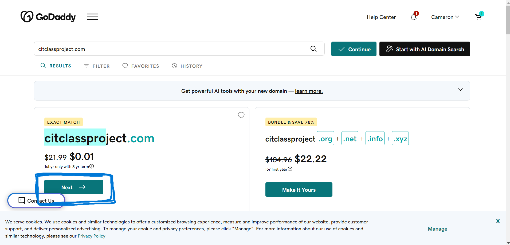
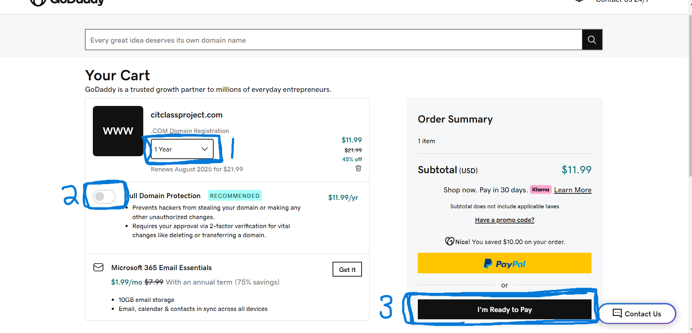
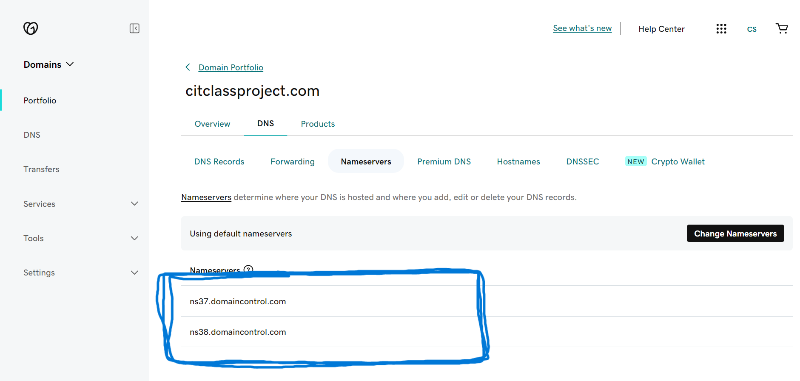
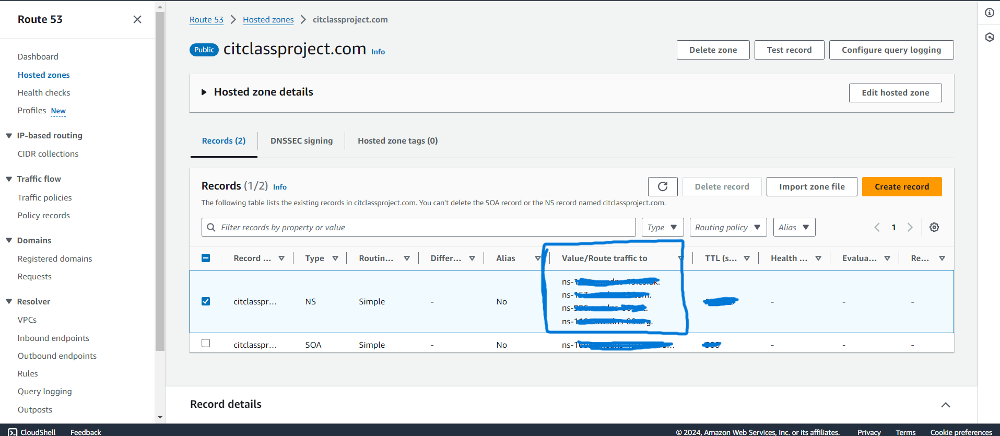

# Computer Information Technology 270

> This is what I could remember on the first day for the first day

1. Create a domain
1. Link domain to AWS class account
1. Create a  instance in EC2 
1. SSH into your EC2 with public DNS (IPv4)
1. Create a record to link the do


## Get a domain
1. Create an account with "godaddy.com".
1. Enter the name of domain you want for class.

<br>


3. From here you will go to your cart.
    > Here are the things I did.

    1. The time for the domain.
    1. Turn off full domain protection.
    1. Now pay.

<br>


## Link domain to AWS class account
- Now that I have paid for the domain, I want to go to try and link my domain to AWS account.
1. At the Home page click on **domain**.
1. Next click **DNS**.
1. Finally click on **nameservers**.
> The page should look like this. Keep this page open and we will come back to it.

<br>


4. Now login to your AWS Canvas account.
    > If you have any problems login to work with the processor.
5. Open the Learners Lab - AM #85291 in the dashboard.
6. Scroll down to Launch AWS Academy Learner Lab.
7. Start the Lab. (When the lab is ready click on the AWS with the button is green on the left of the page)
8. Once inside go to the search bar and look up **"Route 53"**.
9. Click on **Hosted zones**.
10. In Domain name input the domain name you paid.
11. In Type click **Public hosted zone**.
12. Click **Create hosted zone**.
13. Once created this is the page I got.

<br>


14. Take the values and bring them to the **godaddy.com** page we stopped at with the nameservers.
15. Click **Change Nameservers** , **I'll use my own nameservers** copy all four of them over to **godaddy.com**.
16. Once that is done save the changes. (I think that was everything we did in class for this)

## Create a  instance in EC2 
- Once we have add the nameservers close the godaddy webpage I dont recall going back to it. And head on back to the AWS Lab. Once in the lab look up EC2.
1. The Home page should have an **Launch instance**
2. Give the instance a name I used my domain name.
3. Scroll down to Key pair login.
4. Click the down arrow change it to **vockey** (next to Create New key pair)
5. Next in Network settings 
    Allow SSH traffic from      **change to My IP**
    **CHECK THE BOX** Allow HTTPS traffic from the internet
    **CHECK THE BOX**Allow HTTP traffic from the internet
6. **Launch instance**

> Still cant remember how to download the key for this class but i wil ask he on Friday to show us.
> The key I will use in this example is one I sent to myself from class.

## SSH into you machine to see if it up and running.
1. Locate and download your key for class as a pem file. The key is called **labsuser**.
2. Open powershell to the file with the key
> For this example I have moved my key to a directory to awscit270

```markdown 

Windows PowerShell
Copyright (C) Microsoft Corporation. All rights reserved.

Install the latest PowerShell for new features and improvements! https://aka.ms/PSWindows

PS C:\Users\NightShrowd> cd .\awscit270\
PS C:\Users\NightShrowd\awscit270> ls


    Directory: C:\Users\NightShrowd\awscit270


Mode                 LastWriteTime         Length Name
----                 -------------         ------ ----
-a----         8/30/2024  10:12 PM           1678 labsuser.pem

```


> Here we are in the file with the key

3. Now type the command:
```markdown

PS C:\Users\NightShrowd\awscit270> ssh user@<PUBLIC IP-DNS> -i .\labsuser.pem
The authenticity of host '<PUBLIC IP-DNS>' can't be established.

This host key is known by the following other names/addresses:

    C:\Users\NightShrowd/.ssh/known_hosts:5: <Your own IP>

Are you sure you want to continue connecting (yes/no/[fingerprint])? yes
Warning: Permanently added '<PUBLIC IP>' (ED25519) to the list of known hosts.
user@<PUBLIC IP-DNS>: Permission denied (publickey,gssapi-keyex,gssapi-with-mic).
PS C:\Users\NightShrowd\awscit270>
```

> This is good, even though I didn't get into the instance this shows that the machine is running when I **Permission denied**.
